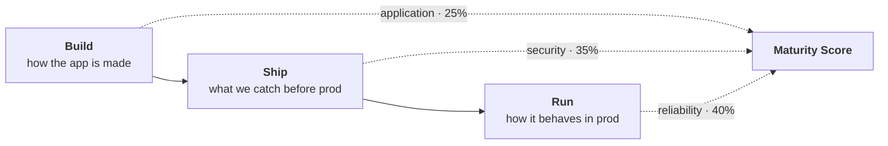

# Maturity Score Card

**A single 0–100 number for how well an application is built, shipped, and run.**

---

## What it does

Engineering maturity is usually invisible. Test coverage lives in one tool, vulnerabilities in
another, availability in a dashboard, incident response in a spreadsheet. Nobody can answer
"is this service in good shape?" without opening six tabs, and nobody can answer "is the
organisation improving?" at all.

Maturity Score Card collects those signals from wherever they already exist, scores each one
on the same 0–100 scale, and rolls them up per app, per team, and per area.

It is **not** a CI/CD scorecard. Pipelines are one source of signal among several — and the
heaviest scorecard is the one measuring what happens *after* deploy:



| Dimension | Scorecard | Weight | Answers |
|---|---|---|---|
| **Build** | `application` | 25% | Is it tested? Instrumented? Does it hold up under load? |
| **Ship** | `security` | 35% | What did we catch before it reached production? |
| **Run** | `reliability` | 40% | Does it stay up? How fast do we notice and recover? |

Anything that can be expressed as a number at the end of a job, a query, or a report can feed
it — a pipeline step, a nightly cron against Prometheus, a scheduled scan, a manual audit.
The service does not care where a value came from.

## What it measures today

Fifteen metrics ship in the box. Each has a scoring function that turns a raw payload into
0–100, so a coverage percentage and a vulnerability count end up comparable.

=== "Run — reliability (40%)"

    | Metric | Measures | Raw input |
    |---|---|---|
    | `sla` | Availability against your SLO | `availability_pct` |
    | `change_failure_rate` | Share of deploys causing a failure | `rate_pct` |
    | `mttd` | How fast you detect an incident | `minutes` |
    | `mttr` | How fast you recover from one | `minutes` |

    This is where SLIs and SLOs land. `sla` takes whatever availability figure your SLI
    already produces — error-budget-based, uptime-based, or synthetic-probe-based — and
    downtime is expressed through it rather than as a separate metric. `mttd` and `mttr` cover
    detection and recovery separately, because a team that recovers fast but detects slowly
    has a very different problem from the reverse.

=== "Ship — security (35%)"

    | Metric | Measures | Raw input |
    |---|---|---|
    | `image_scan` | Vulnerabilities in the container image | `critical`, `high`, `medium` |
    | `sast` | Vulnerabilities in the source | `critical`, `high`, `medium` |
    | `dast` | Vulnerabilities found against a running instance | `high`, `medium` |
    | `secret_scan` | Hardcoded credentials — pass/fail | `found` |

    Counts are weighted by severity, so one critical costs far more than one medium.
    `secret_scan` is deliberately binary: a leaked credential is not a matter of degree.

=== "Build — application (25%)"

    | Metric | Measures | Raw input |
    |---|---|---|
    | `unit_coverage` | Unit test coverage | `percentage` |
    | `integration_coverage` | Integration test coverage | `percentage` |
    | `stress_test` | Error rate, p95 latency and check pass rate under load | `error_rate`, `p95_ms`, `checks_pct` |
    | `libs_observability` | Standard telemetry library in use | `enabled` |
    | `libs_secrets` | Standard secrets library in use | `enabled` |
    | `health_check` | Health endpoint exposed | `enabled` |
    | `unique_db_user` | Dedicated database user | `enabled` |

    The two coverage metrics are scored on different curves — 80% unit coverage and 60%
    integration coverage both earn full marks, because they are not equally cheap to reach.

See **[Scorecards](scorecards.md)** for the exact thresholds behind every metric, and the
[roadmap](roadmap.md) for what is specified, what is deliberately a dashboard panel instead,
and what is not planned.

## Tracking problems, not just scoring them

A score tells you where you stand. It does not tell you what to fix, and it does not survive
being fixed — once a scan is clean, the finding is gone from the score.

`POST /problem/scan-result` is the other half. It records concrete findings (a secret in
`main.tf` at line 42) with severity and file-level detail, and **keeps them until a later scan
reports zero**. That gives you a live worklist and a history of how long things stayed broken,
and it fires a Slack alert the moment something new appears.

## Key properties

- **Partial evaluation.** Weights redistribute automatically among the metrics that actually
  reported. A service with no integration tests is not silently scored as if it had 0% — the
  metric is simply excluded. Send what you have.
- **Stateless service, persistent state.** All state lives in PostgreSQL; the API can be
  restarted, scaled, or replaced freely.
- **Last value wins.** Each `(area, team, app, env, scorecard, metric)` holds exactly one
  score, upserted on every submission. No double counting from pipeline retries.
- **Aggregation is unweighted by size.** Team scores average their apps, area scores average
  their teams — so a team with 40 services does not drown out one with 3.

## Where the numbers go

Scores are exposed at `/metrics` in Prometheus format, scraped every 15s, and pre-aggregated
into recording rules that Grafana reads.

```
CI/CD step · scheduled query · scanner · manual audit
    │
    ▼
POST /score              POST /problem/scan-result
    │                           │
    ▼                           ▼
calculate_score()        save problem state
    │                           │
    └──────────┬────────────────┘
               ▼
          PostgreSQL  ◄──── upsert (state persists until next scan)
               │
               ▼
          GET /metrics  ◄──── Prometheus scrapes every 15s
               │
               ▼
          Prometheus  ──── evaluates PromQL recording rules
               │
               ▼
            Grafana
```

| Service | Role |
|---|---|
| FastAPI | REST API — scoring + problem intake |
| PostgreSQL | State store — latest score and problem count per app |
| Prometheus | Scrapes `/metrics`, evaluates the recording rules |
| Grafana | Dashboards — per app, per team, per area |

[Get started →](getting-started/quickstart.md){ .md-button .md-button--primary }
[See the scorecards →](scorecards.md){ .md-button }
