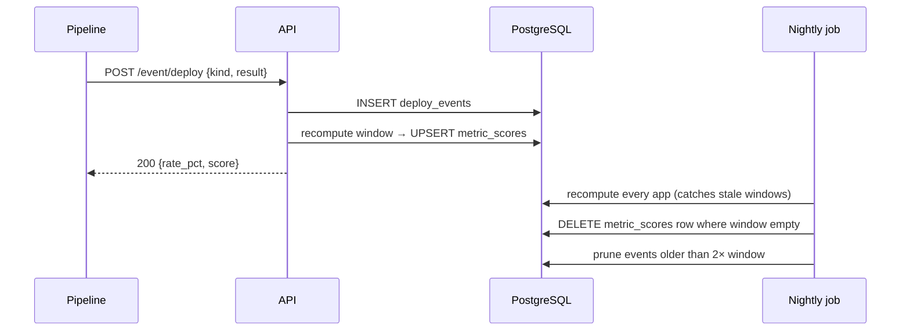

# Design — Delivery and Remediation Metrics

Implements [requirements.md](requirements.md).

## Domain model

### Entities

| Entity | Responsibility | Lifecycle |
|---|---|---|
| `MetricScore` | Latest score for one `(area, team, app, env, scorecard, metric)` | Upserted; last value wins |
| `Problem` | A finding that persists until a scan clears it | `open → resolved → open` (regression) |
| `DeployEvent` | One deploy or rollback attempt | **Immutable** once written; pruned by age |

### Relations

```
DeployEvent  *──1  (area, team, app, env)   aggregated into ──►  MetricScore
Problem      *──1  (area, team, app, env)   aggregated into ──►  MetricScore
```

Neither `DeployEvent` nor `Problem` is owned by `MetricScore`; both are independent substrates
that *derive* scores. Deleting a score does not delete events.

### Invariants

- A `DeployEvent` is never updated or deleted except by the retention prune
- `Problem.first_seen` only moves forward when a resolved finding regresses
- `Problem.resolved_at` is `NULL` if and only if the finding is currently open
- `metric_scores` holds at most one row per `(area, team, app, env, scorecard, metric)` —
  event ingestion must not violate this, which is why events live in their own table
- Weights within a scorecard sum to 1.0

### Rationale — why events, not a submitted ratio

A submitted ratio makes the window the caller's problem: two teams computing "last 30 days"
differently produce incomparable numbers, and the service cannot tell. Storing events moves
the window definition into one place, and makes the raw data available for a different window
later without asking every pipeline to change.

The cost is a new table, a retention policy, and the loss of the "one write per score"
simplicity. Accepted because the comparability problem is not fixable afterwards.

## Schema changes

### New table `deploy_events`

```sql
CREATE TABLE IF NOT EXISTS deploy_events (
    id           BIGSERIAL PRIMARY KEY,
    area         TEXT NOT NULL,
    team         TEXT NOT NULL,
    app          TEXT NOT NULL,
    env          TEXT NOT NULL,
    kind         TEXT NOT NULL CHECK (kind IN ('deploy', 'rollback')),
    result       TEXT NOT NULL CHECK (result IN ('success', 'failure')),
    occurred_at  TIMESTAMPTZ NOT NULL DEFAULT now(),
    pipeline_id  TEXT,
    project_repo TEXT
);

CREATE INDEX IF NOT EXISTS idx_deploy_events_window
    ON deploy_events (area, team, app, env, kind, occurred_at DESC);
```

A surrogate `id` rather than a natural key: deploys are legitimately repeatable, so there is
no tuple that is unique by nature. The index covers the only query shape — count by result
within a window for one app and kind.

### `problems` lifecycle columns

```sql
ALTER TABLE problems ADD COLUMN IF NOT EXISTS first_seen  TIMESTAMPTZ;
ALTER TABLE problems ADD COLUMN IF NOT EXISTS resolved_at TIMESTAMPTZ;
```

The upsert stops blindly setting `updated_at` and starts branching on the transition:

```sql
INSERT INTO problems (..., count, details, first_seen, resolved_at, updated_at)
VALUES (..., %s, %s, CASE WHEN %s > 0 THEN now() END, CASE WHEN %s = 0 THEN now() END, now())
ON CONFLICT (area, team, app, env, problem_type, severity) DO UPDATE SET
    count       = EXCLUDED.count,
    details     = EXCLUDED.details,
    updated_at  = now(),
    -- reopened: restart the clock. still open: keep it. newly open: set it.
    first_seen  = CASE
                    WHEN EXCLUDED.count > 0 AND problems.resolved_at IS NOT NULL THEN now()
                    WHEN EXCLUDED.count > 0 AND problems.first_seen IS NULL      THEN now()
                    ELSE problems.first_seen
                  END,
    resolved_at = CASE
                    WHEN EXCLUDED.count = 0 AND problems.resolved_at IS NULL THEN now()
                    WHEN EXCLUDED.count > 0                                  THEN NULL
                    ELSE problems.resolved_at
                  END;
```

The `problems.resolved_at IS NOT NULL` guard is what distinguishes a regression from a
still-open finding — without it, every scan of an open problem would reset `first_seen` and
remediation time would always read as zero.

### Migration

Existing rows have no history to recover. They migrate as:

- `count > 0` → `first_seen = updated_at`, `resolved_at = NULL`
- `count = 0` → `first_seen = updated_at`, `resolved_at = updated_at` (duration reads as 0)

This is lossy and understates the age of findings open before the migration. Accepted: the
alternative is leaving `first_seen` NULL and excluding those rows from scoring, which hides
exactly the oldest problems.

## Scoring curves

### `deploy_success_rate`

| Success rate | Score |
|---|---|
| ≥ 99% | 100 |
| ≥ 95% | 75 |
| ≥ 90% | 50 |
| < 90% | 25 |

### `rollback_success_rate`

Harsher, deliberately. A rollback is the safety net; a net that works 90% of the time is not
a net.

| Success rate | Score |
|---|---|
| 100% | 100 |
| ≥ 95% | 60 |
| ≥ 80% | 30 |
| < 80% | 0 |

### `error_rate`

Mirrors common availability SLO tiers.

| 5xx rate | Score |
|---|---|
| < 0.1% | 100 |
| < 0.5% | 75 |
| < 1% | 50 |
| < 5% | 25 |
| ≥ 5% | 0 |

### `vuln_remediation_time`

Scored on the **oldest currently open finding**, weighted by severity, because a median
rewards clearing easy findings while a critical rots.

```
age_budget = {critical: 24h, high: 72h, medium: 336h (14d)}
worst = max over open findings of (age / budget[severity])
```

| `worst` | Score | Meaning |
|---|---|---|
| no open findings | 100 | clean |
| ≤ 0.5 | 100 | comfortably inside budget |
| ≤ 1.0 | 75 | inside budget |
| ≤ 2.0 | 40 | up to 2× over |
| > 2.0 | 0 | badly overdue |

## Aggregation flow



### Why the nightly job is required, not optional

Recomputing only on ingestion means a rate freezes the moment deploys stop. An app that
deployed badly and then went quiet would keep its stale score forever, and — worse — an app
whose last deploy falls out of the window would keep a score derived from an empty window. The
nightly pass is what makes "empty window → delete the row" actually happen.

## Weights as one source of truth

`example/prometheus/rules/maturity.yml` hardcodes `0.35 / 0.25 / 0.40` in
`maturity:total_score`. Two options:

| Option | Pro | Con |
|---|---|---|
| **A. Generate the rules file** from `weights.py` via a script, committed output | Impossible to drift | Adds a build step; generated file in git |
| **B. Test asserts agreement** — parse the YAML, compare against `weights.py` | No build step, no generated artefact | Rules still edited by hand |

**Recommendation: B.** The scorecard weights change rarely — this is the first time since the
project started. A failing test gives the same protection as generation at a fraction of the
machinery, and keeps the rules file readable and hand-editable, which matters because it also
holds PromQL that no generator would produce well.

## Observability

| Signal | How |
|---|---|
| Ingestion working | `maturity_deploy_events_total{kind,result}` counter |
| Nightly job ran | `maturity_recompute_last_success_timestamp` gauge; alert if > 26h old |
| Rows dropped for empty windows | Log line per deletion at INFO — silent deletion of a score is otherwise invisible |
| Remediation clock sane | Alert if any `first_seen` is in the future or `resolved_at < first_seen` |

3 a.m. test — the on-call sees `maturity:total_score` drop for a whole team. They need to
distinguish "scores genuinely fell" from "the nightly job deleted rows it should not have".
The INFO log per deletion and the recompute-timestamp gauge are what answer that.

## Rollback

| Change | Reversible? | How |
|---|---|---|
| `deploy_events` table | Yes | Stop calling the endpoint; table is inert. Drop when confident |
| `problems` columns | Yes, additive | Old code ignores the columns entirely |
| Weight rebalance | Yes | Revert `weights.py`; scores recompute on the next `/metrics` scrape |
| New metrics in `SCORERS` | Yes | Removing a scorer makes submissions 400; existing rows persist until deleted |

The weight rebalance is the only change with organisation-wide visibility, and by [R6](
requirements.md#r6-existing-scores-must-not-move) it is a no-op for apps not reporting the new
metrics. Roll back by reverting one dict.

## Failure modes

| Failure | Effect | Mitigation |
|---|---|---|
| Recompute raises during ingestion | Event stored, score stale | Ingestion and recompute in separate try blocks; nightly job repairs |
| Nightly job never runs | Rates freeze silently | Alert on `maturity_recompute_last_success_timestamp` |
| Clock skew on `occurred_at` | Event lands outside the window | Reject > 5 min in the future; clamp past to window start |
| Event flood from a retry loop | Rate skewed, table growth | Retention prune; `[TO CONFIRM]` rate limit per app |
| Scan reports `count = 0` for a finding that was never open | `resolved_at` set on a row that never existed | `INSERT` with `count = 0` sets `first_seen = NULL`; scorer skips rows with NULL `first_seen` |
