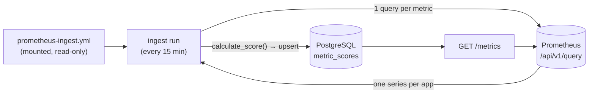

# Design — Direct Prometheus Ingestion

Implements [requirements.md](requirements.md).

## Shape of the thing



The loop back into Prometheus is intentional and not circular: the service reads *application*
telemetry and writes *maturity* metrics. Nothing reads its own output.

### Why the score is computed in Python, not PromQL

The ingest job fetches a **raw value** and passes it through the same `calculate_score()` the
push path uses. It does not compute a score in PromQL.

Scoring in a recording rule would be tempting — the data is already there — but it would put
the thresholds in `maturity.yml` *and* in `app/scoring/`, and nothing would detect them
drifting apart. That is the same duplication the weights already suffer from, and the reason
[vulnerability-remediation](../vulnerability-remediation/tasks.md) opens with a test for it.
One scoring implementation, two ways in.

## Query execution

```
for each configured metric:
    GET {url}/api/v1/query?query=<expr>          # instant query
    for each series in data.result:
        identity = extract(series.metric, config.identity)
        if identity incomplete       -> skip, count bad_identity
        if identity already seen     -> skip both, count duplicate_identity
        if value is NaN/Inf          -> skip, count non_finite
        raw = {config.raw_field: value}
        score = calculate_score(ScoreRequest(..., raw=raw))
        upsert_score(...)
```

An **instant** query, not a range query: every metric here is already an aggregate over a
window expressed inside the PromQL itself (`rate(...[30d])`). Asking for a range would return
a matrix the service would have to reduce, duplicating a decision PromQL already made.

### Duplicate identity

Two series mapping to the same `(area, team, app, env)` means the query under-aggregates —
typically a forgotten label in `by (...)`, e.g. `instance` leaking through. Taking the first
would give a score that changes when pod names change.

Both are skipped and counted. The metric stays at its previous value, which is stale but
explicable; the error counter and the log line name the offending labels.

## Precedence between pull and push

At startup the service loads the ingest config and builds a set of pull-owned metric names.
`POST /score` checks it:

```python
if payload.metric in PULL_OWNED:
    raise HTTPException(409, detail=(
        f"metric '{payload.metric}' is owned by Prometheus ingestion "
        f"(configured in {CONFIG_PATH}); remove it there to accept pushes"
    ))
```

Rationale: the alternative — last write wins — makes a score depend on whether the cron or the
scrape ran last. Two sources, both plausible, no way to tell from the data which one produced
the number in front of you. A 409 costs one confused pipeline author one error message, once.

## Scheduling

| Option | Pro | Con |
|---|---|---|
| **A. In-process** (`asyncio` task in the API) | One container; trivially shares config and DB pool | Every API replica runs it → N× queries and racing upserts. Needs leader election to be correct |
| **B. Separate container** running `python -m app.jobs.ingest` | Runs exactly once regardless of API replicas; API stays stateless | One more thing in compose and in the deployment |

**Recommendation: B.** The project treats statelessness as a property worth protecting — it is
stated in the README and it is why the events table was the awkward part of the earlier draft.
An in-process scheduler makes correctness depend on replica count, which is the kind of
coupling that works locally and breaks on the first horizontal scale.

The same container also hosts any future scheduled work, so it is one moving part, not one per
job.

## Configuration

```yaml
prometheus:
  url: http://prometheus:9090
  timeout_seconds: 30
  bearer_token_env: PROM_BEARER_TOKEN   # optional; name of the env var, not the value

interval_minutes: 15
identity: [area, team, app, env]

metrics:
  - metric: sla
    scorecard: reliability
    raw_field: availability_pct
    query: |
      100 * (
        sum by (area, team, app, env) (rate(http_requests_total{code!~"5.."}[30d]))
        /
        sum by (area, team, app, env) (rate(http_requests_total[30d]))
      )

  # --- Proxies. Enable only if you have no incident tooling. -------------------
  # mttr from alert firing duration is NOT incident duration: it starts when the
  # alert fires (already after detection) and ends when it clears (often after
  # recovery). If you have incident tooling, keep pushing mttr from there.
  #
  # - metric: mttr
  #   scorecard: reliability
  #   raw_field: minutes
  #   query: |
  #     avg by (area, team, app, env) (
  #       sum_over_time(ALERTS{alertstate="firing", severity="critical"}[30d]) / 4
  #     )
  #     # /4 converts 15s samples to minutes; adjust to your scrape_interval.
  #     # [TO CONFIRM against your alerting setup — this is a rough proxy.]
```

The token is referenced by **env var name**, not value, so the config file stays safe to
commit and to mount as a ConfigMap.

### The label mapping problem

The config assumes application telemetry already carries `area`, `team`, `app`, `env`. Most
environments carry *some* of these under different names (`namespace`, `service`,
`kubernetes_namespace`).

Rather than inventing a mapping DSL, the query does it — PromQL already has `label_replace`:

```promql
label_replace(
  sum by (namespace, service) (rate(http_requests_total[30d])),
  "app", "$1", "service", "(.*)"
)
```

**Rationale:** a mapping DSL in config would reimplement, worse, something the query language
does natively — and it would be a second place to debug when a label is wrong. The cost is
that queries get longer. Documented with a worked example rather than abstracted away.

## Observability

| Metric | Type | Purpose |
|---|---|---|
| `maturity_ingest_last_success_timestamp{metric}` | gauge | Alert when a metric stops arriving (`> 3 × interval`) |
| `maturity_ingest_series_total{metric}` | gauge | Series written on the last run |
| `maturity_ingest_errors_total{metric,reason}` | counter | `timeout`, `http_error`, `bad_identity`, `duplicate_identity`, `non_finite` |
| `maturity_ingest_duration_seconds{metric}` | gauge | Catch a query degrading before it times out |

`series_total` is the one that matters most. A query that starts returning zero series after an
unrelated relabelling looks exactly like "nothing to report" — no error, no timeout, scores
simply freeze at their last value. The series count going 125 → 0 is the only signal.

3 a.m. test: reliability scores are stale across every app. The operator needs to distinguish
Prometheus being down (`errors_total{reason="timeout"}` climbing), a broken query
(`series_total` = 0, no errors), and genuinely unchanged scores (`last_success_timestamp`
fresh, `series_total` = 125). Those three are indistinguishable without all three metrics.

## Rollback

| Change | Reversible? | How |
|---|---|---|
| Ingest container | Yes | Stop it. Scores freeze at their last value; nothing is deleted |
| Pull ownership (409s) | Yes | Remove the metric from config, restart. Push works again immediately |
| Config file | Yes | It is read-only input; reverting the file reverts the behaviour |

Nothing in this spec writes a schema change, so there is no migration to unwind. The worst
case — bad queries writing wrong scores — is repaired by fixing the query and waiting one
interval, or by reverting to push.

## Failure modes

| Failure | Effect | Mitigation |
|---|---|---|
| Prometheus down | Scores freeze at last value | R2: never write on failure. Alert on `last_success_timestamp` |
| Query returns 0 series after a relabel | Scores freeze silently | `series_total` gauge — the only detector |
| Query under-aggregates (`instance` leaks) | Duplicate identities | Skip both, count, log the labels |
| Empty denominator → `NaN` | Would score as 0 | R1: non-finite values are skipped, never written |
| Two ingest containers running | Racing upserts of identical values | Harmless — same value, last-write-wins. Not worth leader election |
| Someone pushes a pull-owned metric | Confusion about which number is real | R3: 409 naming the config file |
